# OrbitAg Mobile Access Control

#### *orbit-mobile-access*

### Status

[](https://repo.ccr.net/ccr/websites/orbit/biosecurity-apps-seth/orbit-mobile-access/-/commits/main)

## Description

The OrbitAg Mobile Access Control is a mobile-first web application designed for agricultural facility access management and biosecurity compliance. This React-based mobile application enables field workers, visitors, and facility managers to request access, manage visits, track tasks, and monitor biosecurity status from mobile devices.

The system facilitates:

- Mobile-optimized facility access requests
- Real-time GPS tracking and location services
- Risk assessment and biosecurity status monitoring
- Task management and todo tracking
- Alert and notification system
- Vehicle registration and management
- Profile and user management
- Interactive facility mapping

## Application Architecture

### System Overview

```mermaid
graph TB
    %% User Layer
    User[📱 Mobile Users<br/>Field Workers, Visitors, Facility Staff]
    
    %% Frontend Layer (Mobile-First)
    subgraph "Mobile Frontend Layer (React/TypeScript)"
        direction TB
        Router[🔀 React Router<br/>Mobile Navigation]
        
        subgraph "Core Mobile Pages"
            Dashboard[📊 Dashboard<br/>Risk Status & Today's Tasks]
            Access[🚪 Access Control<br/>Facility Access Requests]
            Map[🗺️ Interactive Map<br/>Facility Locations & GPS]
            Tasks[✅ Tasks<br/>Todo Management]
            Profile[👤 Profile<br/>User Settings & Vehicles]
            Alerts[🔔 Alerts<br/>Notifications & Warnings]
        end
        
        subgraph "Mobile Components"
            BottomNav[📱 Bottom Navigation<br/>Mobile Menu]
            RiskBadge[⚠️ Risk Badge<br/>Status Indicator]
            QuickLinks[⚡ Quick Links<br/>Fast Actions]
            VehicleForm[🚗 Vehicle Form<br/>Registration]
        end
        
        subgraph "State Management"
            ReactQuery[⚡ React Query<br/>Server State Caching]
            AuthContext[🔐 Auth Context<br/>User Authentication]
            AlertsContext[🔔 Alerts Context<br/>Notification State]
            HookForm[📋 React Hook Form<br/>Form Management]
        end
        
        subgraph "UI Framework"
            ShadcnUI[🎨 shadcn/ui<br/>Mobile Components]
            Tailwind[🎭 Tailwind CSS<br/>Responsive Design]
            Theme[🌙 Theme Provider<br/>Dark/Light Mode]
        end
    end
    
    %% Backend Layer
    subgraph "Backend Layer (Supabase)"
        direction TB
        SupaAuth[🔑 Supabase Auth<br/>Mobile Authentication]
        SupaAPI[🔌 Supabase API<br/>Real-time Database]
        RealTime[📡 Real-time Subscriptions<br/>Live Updates]
    end
    
    %% Database Layer
    subgraph "Database Layer (PostgreSQL)"
        direction TB
        
        subgraph "Core Tables"
            Users[(👥 user_profiles<br/>User Information)]
            Facilities[(🏭 facilities<br/>Agricultural Sites)]
            AccessReq[(📋 access_requests<br/>Visit Requests)]
            Tasks[(✅ tasks<br/>User Tasks)]
        end
        
        subgraph "Mobile-Specific Tables"
            Vehicles[(🚗 vehicles<br/>User Vehicles)]
            Locations[(📍 gps_locations<br/>Tracking Data)]
            Alerts[(🔔 alerts<br/>Notifications)]
            RiskStatus[(⚠️ risk_status<br/>Biosecurity Levels)]
        end
    end
    
    %% Connections
    User --> BottomNav
    BottomNav --> Dashboard
    BottomNav --> Access
    BottomNav --> Map
    BottomNav --> Tasks
    BottomNav --> Profile
    BottomNav --> Alerts
    
    Dashboard --> ReactQuery
    Access --> ReactQuery
    Tasks --> ReactQuery
    Profile --> AuthContext
    
    ReactQuery --> SupaAPI
    AuthContext --> SupaAuth
    AlertsContext --> RealTime
    
    SupaAPI --> Users
    SupaAPI --> Facilities
    SupaAPI --> AccessReq
    SupaAPI --> Tasks
    SupaAPI --> Vehicles
    SupaAPI --> Locations
    
    SupaAuth --> Users
    RealTime --> ReactQuery
    
    %% Styling
    classDef mobile fill:#e3f2fd
    classDef backend fill:#f3e5f5
    classDef database fill:#e8f5e8
    classDef user fill:#fff3e0
    
    class Router,Dashboard,Access,Map,Tasks,Profile,Alerts,BottomNav,RiskBadge,QuickLinks,VehicleForm,ReactQuery,AuthContext,AlertsContext,HookForm,ShadcnUI,Tailwind,Theme mobile
    class SupaAuth,SupaAPI,RealTime backend
    class Users,Facilities,AccessReq,Tasks,Vehicles,Locations,Alerts,RiskStatus database
    class User user
```



### Mobile Data Flow Architecture

```mermaid
sequenceDiagram
    participant U as 📱 Mobile User
    participant MA as 📱 Mobile App
    participant RQ as ⚡ React Query
    participant SA as 🔑 Supabase Auth
    participant DB as 🗄️ PostgreSQL
    participant RT as 📡 Real-time

    %% Mobile Authentication Flow
    U->>MA: Open Mobile App
    MA->>SA: Check Auth Status
    SA->>DB: Validate Session
    DB-->>SA: User Profile
    SA-->>MA: Auth State
    MA-->>U: Dashboard or Login

    %% Access Request Flow
    U->>MA: Request Facility Access
    MA->>RQ: Cache Request Data
    RQ->>DB: Insert access_request
    RQ->>DB: Create associated task
    DB-->>RQ: Success Response
    RQ-->>MA: Update Mobile UI
    MA-->>U: Confirmation & Navigation

    %% Real-time Updates
    DB->>RT: Data Change Event
    RT->>RQ: Invalidate Mobile Cache
    RQ->>MA: Re-fetch Data
    MA-->>U: Live Mobile Update

    %% GPS & Location Flow
    U->>MA: Enable Location
    MA->>DB: Update GPS Coordinates
    DB-->>MA: Location Saved
    MA-->>U: Map Update
```



### Mobile Security & Features

```mermaid
graph LR
    subgraph "Mobile Security"
        direction TB
        A[🔐 Session Management<br/>Persistent Auth]
        B[📱 Mobile Tokens<br/>Secure Storage]
        C[🏢 Multi-Tenant<br/>Company Isolation]
        D[✅ Form Validation<br/>Mobile-Optimized]
        E[📍 GPS Security<br/>Location Privacy]
    end
    
    subgraph "Mobile Features"
        direction TB
        F[📱 Responsive Design<br/>Mobile-First UI]
        G[🌙 Dark Mode<br/>Theme Support]
        H[📶 Offline Support<br/>Cached Data]
        I[🔔 Push Notifications<br/>Real-time Alerts]
        J[🗺️ Interactive Maps<br/>GPS Integration]
    end
    
    A --> F
    B --> G
    C --> H
    D --> I
    E --> J
```



## Point of Contact

> Craig Barkley
>
> Seth Biosecurity Team

## Dependencies/Technologies

### Frontend Stack

- **React 18** - Modern React with hooks and functional components
- **TypeScript** - Type-safe JavaScript development
- **Vite** - Fast build tool and development server
- **Tailwind CSS** - Mobile-first utility CSS framework
- **shadcn/ui** - Modern mobile-optimized component library
- **React Router** - Client-side routing for mobile navigation
- **React Query (TanStack Query)** - Server state management and caching
- **React Hook Form** - Mobile-friendly form handling
- **Zod** - TypeScript-first schema validation
- **Next Themes** - Dark/light mode support for mobile

### Mobile-Specific Libraries

- **Lucide React** - Mobile-optimized icons
- **Date-fns** - Date manipulation for mobile
- **Recharts** - Mobile-responsive charts
- **Sonner** - Mobile toast notifications
- **Vaul** - Mobile drawer components

### Backend Integration

- **Supabase** - Backend-as-a-Service for mobile authentication and database
- **PostgreSQL** - Primary database (via Supabase)

### Development Tools

- **ESLint** - Code linting and quality
- **PostCSS & Autoprefixer** - CSS processing for mobile browsers
- **Lovable Tagger** - Development tooling

## Databases

### Connection Strings in environment variables

| Database | Status | Type | Description |
|----------|--------|------|-------------|
| Supabase | active | PostgreSQL | Primary database for user profiles, access requests, tasks, facilities, vehicles, and GPS tracking |

## Running Locally

### Software Prerequisites

- **Node.js** (v18 or higher recommended)
- **npm** or **bun** package manager
- Modern mobile browser or browser developer tools for mobile simulation

### How to Install & Run

1. **Clone the Repository**

   ```bash
   git clone <YOUR_GIT_URL>
   cd orbit-mobile-access
   ```

2. **Install Dependencies**

   ```bash
   npm install
   # or if using bun
   bun install
   ```

3. **Environment Setup**

   #### Current Configuration Status

   The project currently has **hardcoded** Supabase credentials in the codebase, which is not a security best practice for production applications.

   #### Current API Keys & Configuration

   - **Supabase URL:** `https://wdzhmpbwcbodwozxgyub.supabase.co` (currently hardcoded)
   - **Supabase Anon Key:** Currently exposed in `src/integrations/supabase/client.ts` (currently hardcoded)

   ⚠️ **Security Warning:** The current setup has API keys hardcoded in the source code, which should be moved to environment variables before production deployment.

   #### Recommended Environment Setup

   **Step 1: Create Environment Files**

   ```bash
   # Create environment file (already gitignored)
   touch .env.local
   ```

   **Step 2: Configure Environment Variables**
   Add the following variables to your `.env.local` file:

   ```bash
   # Supabase Configuration
   VITE_SUPABASE_URL=https://wdzhmpbwcbodwozxgyub.supabase.co
   VITE_SUPABASE_ANON_KEY=your_supabase_anon_key_here

   # Auth0 Configuration (for future iOS rebuild)
   VITE_AUTH0_DOMAIN=your_auth0_domain
   VITE_AUTH0_CLIENT_ID=your_auth0_client_id

   # API Configuration
   VITE_API_BASE_URL=http://localhost:3000/api
   VITE_API_TIMEOUT=10000

   # App Configuration
   VITE_APP_ENV=development
   VITE_APP_VERSION=1.0.0
   ```

   **Step 3: Update Supabase Client Configuration**
   Modify `src/integrations/supabase/client.ts` to use environment variables:

   ```typescript
   import { createClient } from '@supabase/supabase-js';
   import type { Database } from './types';

   const SUPABASE_URL = import.meta.env.VITE_SUPABASE_URL;
   const SUPABASE_PUBLISHABLE_KEY = import.meta.env.VITE_SUPABASE_ANON_KEY;

   if (!SUPABASE_URL || !SUPABASE_PUBLISHABLE_KEY) {
     throw new Error('Missing Supabase environment variables');
   }

   export const supabase = createClient<Database>(SUPABASE_URL, SUPABASE_PUBLISHABLE_KEY);
   ```

   **Step 4: Environment-Specific Configuration**
   For different deployment environments, create separate files:
   - `.env.local` - Local development
   - `.env.staging` - Staging environment  
   - `.env.production` - Production environment

   #### Required API Keys & Services

   | Service | Purpose | Required For | How to Obtain |
   |---------|---------|--------------|---------------|
   | **Supabase** | Database & Auth | Core functionality | [supabase.com](https://supabase.com) - Create project |
   | **Auth0** | Authentication (iOS rebuild) | iOS native app | [auth0.com](https://auth0.com) - Create application |
   | **Google Maps** | Location services | Map functionality | [Google Cloud Console](https://console.cloud.google.com) |
   | **Firebase** | Push notifications | Mobile alerts | [Firebase Console](https://console.firebase.google.com) |

   #### Security Best Practices

   ✅ **Do:**
   - Use environment variables for all API keys
   - Never commit `.env.local` files to version control
   - Use different keys for development, staging, and production
   - Rotate API keys regularly
   - Use the principle of least privilege for API key permissions

   ❌ **Don't:**
   - Hardcode API keys in source code
   - Share API keys in chat/email
   - Use production keys in development
   - Commit environment files to Git

   #### Troubleshooting Environment Issues

   **Issue: "Missing Supabase environment variables"**

   ```bash
   # Solution: Ensure .env.local exists with correct variables
   cp .env.example .env.local  # If you have an example file
   # Then add your actual API keys
   ```

   **Issue: Environment variables not loading**

   ```bash
   # Solution: Restart the development server
   npm run dev
   # Vite requires restart to pick up new environment variables
   ```

   **Issue: CORS errors with API calls**

   ```bash
   # Solution: Check VITE_API_BASE_URL is correct
   # Ensure your API server allows your domain in CORS settings
   ```

4. **Start Development Server**

   ```bash
   npm run dev
   # or with bun
   bun run dev
   ```

5. **Access the Mobile Application**
   - Open your browser to `http://localhost:5173`
   - Use browser developer tools to simulate mobile devices
   - The application will redirect to login or dashboard

### Available Scripts

- `npm run dev` - Start development server with hot reload
- `npm run build` - Build production version
- `npm run build:dev` - Build development version
- `npm run preview` - Preview production build locally
- `npm run lint` - Run ESLint code analysis

## Application Features

### Core Mobile Modules

1. **Dashboard** - Mobile overview with risk status, today's tasks, and quick actions
2. **Access Control** - Facility access requests with company switching
3. **Interactive Map** - GPS-enabled facility mapping and location services
4. **Task Management** - Mobile todo list and task tracking
5. **Profile Management** - User settings, vehicle registration, and preferences
6. **Alerts & Notifications** - Real-time mobile alerts and warnings
7. **Vehicle Management** - Registration and management of user vehicles

### Key Mobile Pages

- **Dashboard** (`/`) - Main mobile overview with risk badge and quick links
- **Access** (`/access`) - Facility access request interface
- **Map** (`/map`) - Interactive facility map with GPS integration
- **Tasks** (`/tasks`) - Mobile task management
- **Profile** (`/profile`) - User profile and vehicle management
- **Alerts** (`/alerts`) - Mobile notification center
- **Vehicle Form** (`/add-vehicle`) - Vehicle registration form
- **Access Wizard** (`/access-wizard`) - Guided access request process

### Mobile Navigation

- **Bottom Navigation** - Mobile-first navigation bar
- **Responsive Design** - Optimized for all mobile screen sizes
- **Touch-Friendly** - Large tap targets and swipe gestures
- **Dark Mode** - System-aware theme switching

## Testing the Mobile Project

### Development Environment

- Local development server: `http://localhost:5173`
- Mobile simulation: Use browser developer tools
- Authentication: Supabase-managed mobile authentication
- Database: PostgreSQL via Supabase

### Mobile Testing

- **Responsive Testing** - Test on various mobile screen sizes
- **Touch Testing** - Verify touch interactions and gestures
- **Performance Testing** - Monitor mobile loading times
- **Offline Testing** - Test cached data functionality

## Publishing

### Development Workflow

- The application uses Vite for fast mobile-optimized builds
- All changes should be tested on mobile devices before deployment
- Environment-specific configurations are managed through build modes

### Mobile Deployment Process

The mobile application can be deployed to various hosting platforms:

1. **Build the Mobile Application**

   ```bash
   npm run build
   ```

2. **Deploy as PWA**
   - Upload the `dist/` folder to your hosting provider
   - Configure service worker for offline functionality
   - Set up mobile-specific meta tags and manifests

### Supported Mobile Deployment Platforms

- **Lovable Platform** - Direct mobile deployment via Lovable interface
- **Vercel** - Automatic mobile-optimized deployments
- **Netlify** - Mobile-first static hosting
- **AWS S3 + CloudFront** - Scalable mobile delivery
- **PWA Hosting** - Progressive Web App deployment

## Security & Mobile Compliance

The mobile application implements several security measures:

- **Mobile Session Management** - Secure token storage on mobile devices
- **Company Data Isolation** - Multi-tenant security for mobile access
- **GPS Privacy** - Secure location handling and privacy controls
- **Mobile Form Validation** - Client and server-side validation
- **Secure Mobile Storage** - Protected local data caching

## Mobile Architecture

### Component Structure

- **Pages** (`/src/pages/`) - Mobile page components
- **Components** (`/src/components/`) - Reusable mobile UI components
- **Hooks** (`/src/hooks/`) - Custom React hooks for mobile state management
- **Contexts** (`/src/contexts/`) - Global mobile app state
- **Integrations** (`/src/integrations/`) - Supabase mobile integration

### Mobile State Management

- **React Query** - Server state caching optimized for mobile
- **React Context** - Global mobile app state (auth, alerts)
- **React Hook Form** - Mobile-friendly form state management
- **Local Storage** - Persistent mobile user preferences

### Mobile Performance

- **Code Splitting** - Optimized bundle loading for mobile
- **Lazy Loading** - Component-level lazy loading
- **Caching Strategy** - Aggressive caching for mobile performance
- **Responsive Images** - Mobile-optimized image delivery
