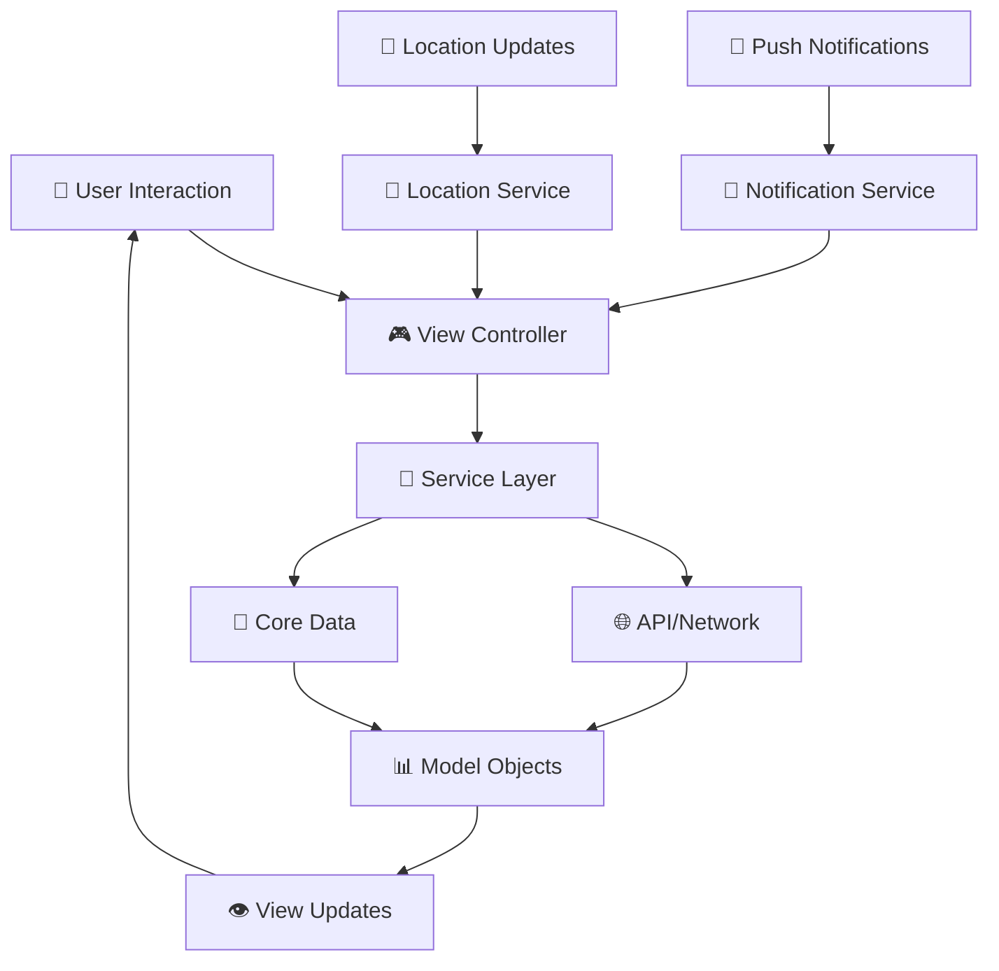

# iOS MVC Architecture Scaffolding

## OrbitAg Mobile Access Control - Native iOS App Structure

### Overview

This document outlines the complete file and folder structure for rebuilding the OrbitAg Mobile Access Control app as a native iOS application using the Model-View-Controller (MVC) architecture pattern in Xcode.

## Project Structure

```
OrbitAgMobileAccess/
├── 📱 OrbitAgMobileAccess/                    # Main application target
│   ├── 🏗️ Application/                        # App lifecycle and configuration
│   │   ├── AppDelegate.swift                 # App delegate (iOS 12+ compatibility)
│   │   ├── SceneDelegate.swift               # Scene delegate (iOS 13+)
│   │   ├── Info.plist                        # App configuration and permissions
│   │   └── LaunchScreen.storyboard           # Launch screen
│   │
│   ├── 📊 Models/                            # Data models and business logic
│   │   ├── Core/
│   │   │   ├── User.swift                    # User profile model
│   │   │   ├── Company.swift                 # Company/tenant model
│   │   │   ├── Facility.swift                # Agricultural facility model
│   │   │   ├── AccessRequest.swift           # Access request model
│   │   │   ├── Task.swift                    # Task/todo model
│   │   │   ├── Vehicle.swift                 # Vehicle registration model
│   │   │   ├── Alert.swift                   # Alert/notification model
│   │   │   ├── RiskStatus.swift              # Biosecurity risk model
│   │   │   └── Location.swift                # GPS location model
│   │   │
│   │   ├── Networking/
│   │   │   ├── APIModels/
│   │   │   │   ├── AuthResponse.swift        # Auth0 response models
│   │   │   │   ├── UserProfileResponse.swift
│   │   │   │   ├── FacilityResponse.swift
│   │   │   │   ├── AccessRequestResponse.swift
│   │   │   │   ├── TaskResponse.swift
│   │   │   │   └── VehicleResponse.swift
│   │   │   │
│   │   │   └── RequestModels/
│   │   │       ├── LoginRequest.swift
│   │   │       ├── AccessRequestCreate.swift
│   │   │       ├── TaskCreate.swift
│   │   │       ├── VehicleCreate.swift
│   │   │       └── LocationUpdate.swift
│   │   │
│   │   └── Persistence/
│   │       ├── CoreDataModels/
│   │       │   ├── OrbitAgDataModel.xcdatamodeld # Core Data model
│   │       │   ├── CDUser+CoreDataClass.swift
│   │       │   ├── CDFacility+CoreDataClass.swift
│   │       │   ├── CDTask+CoreDataClass.swift
│   │       │   └── CDVehicle+CoreDataClass.swift
│   │       │
│   │       └── UserDefaults/
│   │           └── UserPreferences.swift      # User settings and preferences
│   │
│   ├── 👁️ Views/                              # UI components and storyboards
│   │   ├── Storyboards/
│   │   │   ├── Main.storyboard               # Main app storyboard
│   │   │   ├── Auth.storyboard               # Authentication flows
│   │   │   ├── Dashboard.storyboard          # Dashboard screens
│   │   │   ├── Access.storyboard             # Access control screens
│   │   │   ├── Map.storyboard                # Map and location screens
│   │   │   ├── Tasks.storyboard              # Task management screens
│   │   │   ├── Profile.storyboard            # Profile and settings screens
│   │   │   └── Alerts.storyboard             # Alerts and notifications
│   │   │
│   │   ├── CustomViews/
│   │   │   ├── Components/
│   │   │   │   ├── RiskBadgeView.swift       # Risk status badge component
│   │   │   │   ├── QuickActionButton.swift   # Dashboard quick action buttons
│   │   │   │   ├── FacilityCardView.swift    # Facility information card
│   │   │   │   ├── TaskCellView.swift        # Task list cell
│   │   │   │   ├── VehicleCardView.swift     # Vehicle display component
│   │   │   │   ├── AlertBannerView.swift     # Alert notification banner
│   │   │   │   └── LoadingSpinnerView.swift  # Loading indicator
│   │   │   │
│   │   │   ├── Forms/
│   │   │   │   ├── AccessRequestForm.swift   # Access request form
│   │   │   │   ├── TaskCreationForm.swift    # Task creation form
│   │   │   │   ├── VehicleRegistrationForm.swift # Vehicle form
│   │   │   │   └── ProfileEditForm.swift     # Profile editing form
│   │   │   │
│   │   │   └── MapComponents/
│   │   │       ├── FacilityAnnotationView.swift # Map facility pins
│   │   │       ├── UserLocationView.swift    # User location indicator
│   │   │       └── RouteOverlayView.swift    # Route visualization
│   │   │
│   │   ├── TableViewCells/
│   │   │   ├── TaskTableViewCell.swift       # Task list cell
│   │   │   ├── VehicleTableViewCell.swift    # Vehicle list cell
│   │   │   ├── AlertTableViewCell.swift      # Alert list cell
│   │   │   ├── FacilityTableViewCell.swift   # Facility list cell
│   │   │   └── AccessRequestTableViewCell.swift # Access request cell
│   │   │
│   │   └── XIBs/
│   │       ├── RiskBadgeView.xib
│   │       ├── QuickActionButton.xib
│   │       ├── TaskTableViewCell.xib
│   │       ├── VehicleTableViewCell.xib
│   │       └── AlertTableViewCell.xib
│   │
│   ├── 🎮 Controllers/                        # View controllers
│   │   ├── Authentication/
│   │   │   ├── LoginViewController.swift     # Auth0 login screen
│   │   │   ├── BiometricAuthViewController.swift # Face ID/Touch ID
│   │   │   └── CompanySelectionViewController.swift # Multi-tenant selection
│   │   │
│   │   ├── TabBar/
│   │   │   └── MainTabBarController.swift    # Main tab bar controller
│   │   │
│   │   ├── Dashboard/
│   │   │   ├── DashboardViewController.swift # Main dashboard
│   │   │   └── RiskStatusViewController.swift # Risk status details
│   │   │
│   │   ├── AccessControl/
│   │   │   ├── AccessControlViewController.swift # Access request list
│   │   │   ├── AccessRequestViewController.swift # Create access request
│   │   │   ├── AccessWizardViewController.swift # Guided access wizard
│   │   │   └── FacilityDetailViewController.swift # Facility information
│   │   │
│   │   ├── Map/
│   │   │   ├── MapViewController.swift       # Main map view
│   │   │   ├── FacilityMapViewController.swift # Facility-specific map
│   │   │   └── LocationTrackingViewController.swift # GPS tracking
│   │   │
│   │   ├── Tasks/
│   │   │   ├── TaskListViewController.swift  # Task list management
│   │   │   ├── TaskDetailViewController.swift # Task details/editing
│   │   │   └── TaskCreationViewController.swift # New task creation
│   │   │
│   │   ├── Profile/
│   │   │   ├── ProfileViewController.swift   # User profile main
│   │   │   ├── ProfileEditViewController.swift # Edit profile
│   │   │   ├── VehicleManagementViewController.swift # Vehicle list
│   │   │   ├── VehicleDetailViewController.swift # Vehicle details
│   │   │   ├── AddVehicleViewController.swift # Add new vehicle
│   │   │   └── SettingsViewController.swift  # App settings
│   │   │
│   │   ├── Alerts/
│   │   │   ├── AlertsViewController.swift    # Alerts list
│   │   │   ├── AlertDetailViewController.swift # Alert details
│   │   │   └── NotificationSettingsViewController.swift # Notification prefs
│   │   │
│   │   └── Common/
│   │       ├── BaseViewController.swift      # Base view controller class
│   │       ├── LoadingViewController.swift   # Loading screen
│   │       └── ErrorViewController.swift     # Error handling screen
│   │
│   ├── 🔧 Services/                          # Business logic and external services
│   │   ├── Authentication/
│   │   │   ├── Auth0Service.swift           # Auth0 integration
│   │   │   ├── BiometricAuthService.swift   # Face ID/Touch ID service
│   │   │   ├── KeychainService.swift        # Secure token storage
│   │   │   └── SessionManager.swift         # Session management
│   │   │
│   │   ├── Networking/
│   │   │   ├── APIService.swift             # Base API service
│   │   │   ├── NetworkManager.swift         # Network layer
│   │   │   ├── APIEndpoints.swift           # API endpoint definitions
│   │   │   └── NetworkError.swift           # Network error handling
│   │   │
│   │   ├── DataServices/
│   │   │   ├── UserService.swift            # User data operations
│   │   │   ├── FacilityService.swift        # Facility data operations
│   │   │   ├── AccessRequestService.swift   # Access request operations
│   │   │   ├── TaskService.swift            # Task data operations
│   │   │   ├── VehicleService.swift         # Vehicle data operations
│   │   │   └── AlertService.swift           # Alert data operations
│   │   │
│   │   ├── Location/
│   │   │   ├── LocationService.swift        # Core Location integration
│   │   │   ├── GPSTrackingService.swift     # GPS tracking logic
│   │   │   └── GeofencingService.swift      # Geofencing for facilities
│   │   │
│   │   ├── Notifications/
│   │   │   ├── PushNotificationService.swift # APNs integration
│   │   │   ├── LocalNotificationService.swift # Local notifications
│   │   │   └── NotificationHandler.swift    # Notification processing
│   │   │
│   │   ├── Persistence/
│   │   │   ├── CoreDataService.swift        # Core Data operations
│   │   │   ├── CacheService.swift           # Data caching logic
│   │   │   └── SyncService.swift            # Data synchronization
│   │   │
│   │   └── Camera/
│   │       ├── CameraService.swift          # Camera integration
│   │       ├── DocumentScannerService.swift # Document scanning
│   │       └── ImageProcessingService.swift # Image processing
│   │
│   ├── 🛠️ Utilities/                         # Helper classes and extensions
│   │   ├── Extensions/
│   │   │   ├── UIViewController+Extensions.swift
│   │   │   ├── UIView+Extensions.swift
│   │   │   ├── String+Extensions.swift
│   │   │   ├── Date+Extensions.swift
│   │   │   ├── UIColor+Extensions.swift
│   │   │   └── Data+Extensions.swift
│   │   │
│   │   ├── Helpers/
│   │   │   ├── ValidationHelper.swift       # Form validation
│   │   │   ├── DateFormatter.swift          # Date formatting utilities
│   │   │   ├── ImageHelper.swift            # Image processing utilities
│   │   │   ├── LocationHelper.swift         # Location utilities
│   │   │   └── BiometricHelper.swift        # Biometric authentication helper
│   │   │
│   │   ├── Constants/
│   │   │   ├── AppConstants.swift           # App-wide constants
│   │   │   ├── APIConstants.swift           # API-related constants
│   │   │   ├── ColorConstants.swift         # App color palette
│   │   │   └── FontConstants.swift          # App typography
│   │   │
│   │   └── Protocols/
│   │       ├── Configurable.swift           # View configuration protocol
│   │       ├── Identifiable.swift           # Cell identifier protocol
│   │       ├── Coordinator.swift            # Navigation coordinator protocol
│   │       └── DataSource.swift             # Data source protocol
│   │
│   ├── 🎨 Resources/                         # Assets and resources
│   │   ├── Assets.xcassets/
│   │   │   ├── AppIcon.appiconset/          # App icons
│   │   │   ├── Colors/
│   │   │   │   ├── PrimaryColor.colorset
│   │   │   │   ├── SecondaryColor.colorset
│   │   │   │   ├── AccentColor.colorset
│   │   │   │   ├── SuccessColor.colorset
│   │   │   │   ├── WarningColor.colorset
│   │   │   │   └── ErrorColor.colorset
│   │   │   │
│   │   │   ├── Images/
│   │   │   │   ├── Icons/
│   │   │   │   │   ├── dashboard-icon.imageset
│   │   │   │   │   ├── access-icon.imageset
│   │   │   │   │   ├── map-icon.imageset
│   │   │   │   │   ├── tasks-icon.imageset
│   │   │   │   │   ├── profile-icon.imageset
│   │   │   │   │   └── alerts-icon.imageset
│   │   │   │   │
│   │   │   │   ├── Illustrations/
│   │   │   │   │   ├── empty-state.imageset
│   │   │   │   │   ├── error-state.imageset
│   │   │   │   │   └── loading-state.imageset
│   │   │   │   │
│   │   │   │   └── Branding/
│   │   │   │       ├── orbit-logo.imageset
│   │   │   │       └── company-logo.imageset
│   │   │   │
│   │   │   └── Data/
│   │   │       └── sample-data.dataset       # Sample data for development
│   │   │
│   │   ├── Fonts/
│   │   │   ├── CustomFont-Regular.ttf
│   │   │   ├── CustomFont-Bold.ttf
│   │   │   └── CustomFont-Light.ttf
│   │   │
│   │   ├── Sounds/
│   │   │   ├── notification-sound.wav
│   │   │   ├── success-sound.wav
│   │   │   └── alert-sound.wav
│   │   │
│   │   └── Localizable.strings              # Localization strings
│   │
│   └── 🔒 Configuration/                     # App configuration
│       ├── Development/
│       │   ├── Config-Dev.plist             # Development configuration
│       │   └── GoogleService-Info-Dev.plist # Firebase dev config (if used)
│       │
│       ├── Staging/
│       │   ├── Config-Staging.plist         # Staging configuration
│       │   └── GoogleService-Info-Staging.plist
│       │
│       ├── Production/
│       │   ├── Config-Prod.plist            # Production configuration
│       │   └── GoogleService-Info-Prod.plist
│       │
│       └── Environment.swift                # Environment configuration manager
│
├── 🧪 OrbitAgMobileAccessTests/              # Unit tests
│   ├── ModelTests/
│   │   ├── UserTests.swift
│   │   ├── FacilityTests.swift
│   │   ├── AccessRequestTests.swift
│   │   ├── TaskTests.swift
│   │   └── VehicleTests.swift
│   │
│   ├── ServiceTests/
│   │   ├── Auth0ServiceTests.swift
│   │   ├── APIServiceTests.swift
│   │   ├── LocationServiceTests.swift
│   │   ├── CoreDataServiceTests.swift
│   │   └── PushNotificationServiceTests.swift
│   │
│   ├── ViewControllerTests/
│   │   ├── DashboardViewControllerTests.swift
│   │   ├── AccessControlViewControllerTests.swift
│   │   ├── MapViewControllerTests.swift
│   │   ├── TaskListViewControllerTests.swift
│   │   └── ProfileViewControllerTests.swift
│   │
│   ├── UtilityTests/
│   │   ├── ValidationHelperTests.swift
│   │   ├── DateFormatterTests.swift
│   │   └── LocationHelperTests.swift
│   │
│   └── MockData/
│       ├── MockAPIService.swift
│       ├── MockAuthService.swift
│       ├── MockLocationService.swift
│       └── TestData.swift
│
├── 🎯 OrbitAgMobileAccessUITests/            # UI tests
│   ├── AuthenticationUITests.swift
│   ├── DashboardUITests.swift
│   ├── AccessControlUITests.swift
│   ├── MapUITests.swift
│   ├── TaskManagementUITests.swift
│   ├── ProfileUITests.swift
│   ├── AlertsUITests.swift
│   └── EndToEndUITests.swift
│
├── 📦 Frameworks/                            # Third-party frameworks
│   ├── Auth0/                               # Auth0 iOS SDK
│   ├── Alamofire/                           # Networking
│   ├── Kingfisher/                          # Image loading
│   └── Lottie/                              # Animations
│
├── 🔧 Scripts/                               # Build and automation scripts
│   ├── build-phases/
│   │   ├── swiftlint.sh                     # SwiftLint integration
│   │   ├── increment-build.sh               # Build number increment
│   │   └── copy-environment.sh              # Environment file copying
│   │
│   └── ci-cd/
│       ├── archive.sh                       # Archive for App Store
│       ├── test.sh                          # Run all tests
│       └── upload-symbols.sh                # Upload debug symbols
│
├── 📋 OrbitAgMobileAccess.xcodeproj/        # Xcode project file
│   ├── project.pbxproj                      # Project configuration
│   └── xcshareddata/
│       └── xcschemes/
│           ├── OrbitAgMobileAccess-Dev.xcscheme
│           ├── OrbitAgMobileAccess-Staging.xcscheme
│           └── OrbitAgMobileAccess-Prod.xcscheme
│
├── 🔧 OrbitAgMobileAccess.xcworkspace/      # Xcode workspace (if using CocoaPods)
│
├── 📝 Podfile                               # CocoaPods dependencies
├── 📝 Podfile.lock                          # Locked dependency versions
├── 📝 Package.swift                         # Swift Package Manager (alternative)
├── 📝 .gitignore                            # Git ignore rules
├── 📝 README.md                             # Project documentation
└── 📝 CHANGELOG.md                          # Version history
```

## Key MVC Architecture Principles

### 🏗️ **Models (Data Layer)**

- **Core Models**: Business entities (User, Facility, AccessRequest, etc.)
- **API Models**: Request/Response DTOs for network communication
- **Persistence Models**: Core Data entities for offline storage
- **Single Responsibility**: Each model handles one specific data concern

### 👁️ **Views (Presentation Layer)**

- **Storyboards**: Visual interface design and navigation flow
- **Custom Views**: Reusable UI components and forms
- **Table View Cells**: List item presentations
- **XIB Files**: Interface Builder files for complex custom views
- **No Business Logic**: Views only handle display and user interaction

### 🎮 **Controllers (Logic Layer)**

- **View Controllers**: Manage view lifecycle and user interactions
- **Navigation Logic**: Handle screen transitions and user flow
- **Data Binding**: Connect models to views
- **User Input Handling**: Process and validate user actions
- **Delegate Pattern**: Implement protocols for communication

## Supporting Architecture Components

### 🔧 **Services Layer**

- **Authentication**: Auth0 integration and session management
- **Networking**: API communication and data fetching
- **Location**: GPS tracking and geofencing
- **Notifications**: Push and local notification handling
- **Persistence**: Core Data operations and caching

### 🛠️ **Utilities Layer**

- **Extensions**: Swift language extensions for common operations
- **Helpers**: Utility classes for validation, formatting, etc.
- **Constants**: App-wide configuration and styling constants
- **Protocols**: Common interfaces for consistent implementation

## Data Flow Architecture



## Development Workflow

### 🏗️ **Setup Phase**

1. Create Xcode project with target configurations
2. Set up CocoaPods or Swift Package Manager
3. Configure build schemes for Dev/Staging/Production
4. Set up Core Data model
5. Configure Auth0 SDK

### 🔄 **Development Phase**

1. Implement models and data layer
2. Create view controllers and navigation flow
3. Build custom UI components
4. Integrate services and external APIs
5. Add comprehensive error handling

### 🧪 **Testing Phase**

1. Write unit tests for models and services
2. Create UI tests for critical user flows
3. Test on multiple iOS devices and versions
4. Perform security and performance testing
5. TestFlight beta testing with real users

### 🚀 **Deployment Phase**

1. Configure App Store Connect
2. Create app screenshots and metadata
3. Submit for App Store review
4. Monitor crash reports and user feedback
5. Plan iterative updates and feature releases

## Key Implementation Notes

### 🔐 **Security Considerations**

- Use iOS Keychain for secure token storage
- Implement certificate pinning for API calls
- Add biometric authentication where appropriate
- Follow iOS security best practices
- Implement proper data encryption

### 📱 **iOS-Specific Features**

- Native navigation patterns (UINavigationController, UITabBarController)
- iOS design guidelines compliance
- Background app refresh capabilities
- Push notification integration
- MapKit for native map functionality
- Camera and photo library integration

### 🎯 **Performance Optimizations**

- Lazy loading of view controllers
- Image caching and optimization
- Core Data fetch request optimization
- Background queue processing for heavy operations
- Memory management best practices

This MVC architecture provides a solid foundation for building a maintainable, scalable, and iOS-native version of the OrbitAg Mobile Access Control application.
