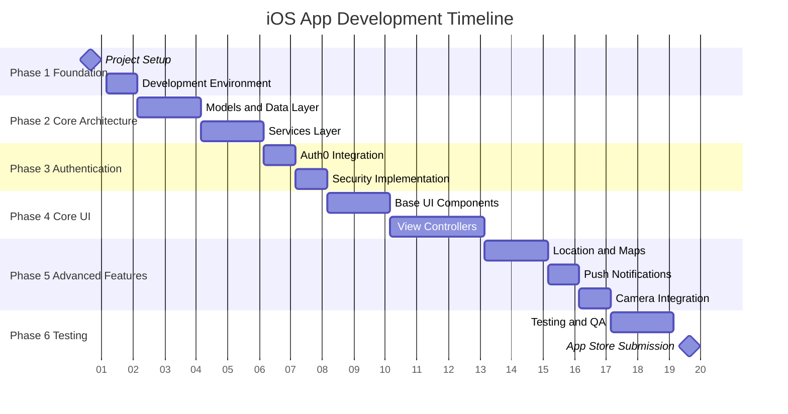

# iOS Development Timeline

## OrbitAg Mobile Access Control - Native iOS Build Schedule

### Overview

This timeline outlines the estimated development schedule for building the complete iOS MVC architecture scaffolding. The timeline is broken down into phases with weekly milestones and deliverables.

## Project Timeline Summary

---

**Total Duration:** 20 weeks (5 months)

---

**Team Size:** 2-3 iOS developers + 1 backend developer

---

**Phases:** 6 major phases

---



## Detailed Weekly Breakdown

### Phase 1: Foundation & Setup (Weeks 1-2)

#### Week 1: Project Setup & Configuration

**Deliverables:**

- [ ] Xcode project creation with proper structure
- [ ] Build schemes for Dev/Staging/Production
- [ ] CocoaPods/SPM dependency management setup
- [ ] Git repository and CI/CD pipeline configuration
- [ ] Team development environment setup

**Key Activities:**

- Create Xcode workspace with proper folder structure
- Configure build settings and deployment targets
- Set up version control and branching strategy
- Install and configure development tools (SwiftLint, etc.)
- Create base project documentation

**Resources Required:**

- 1 Senior iOS Developer
- 1 DevOps Engineer (part-time)

---

#### Week 2: Development Environment & Backend Setup

**Deliverables:**

- [ ] Backend API structure planning
- [ ] Database schema design and creation
- [ ] Auth0 tenant setup and configuration
- [ ] Development/staging server deployment
- [ ] API documentation framework

**Key Activities:**

- PostgreSQL database setup with initial schema
- Auth0 application configuration
- Backend API skeleton with authentication endpoints
- Environment configuration files
- Development server deployment

**Resources Required:**

- 1 Backend Developer
- 1 iOS Developer (for API planning)

---

### Phase 2: Core Architecture (Weeks 3-6)

#### Week 3: Core Models Development

**Deliverables:**

- [ ] Core business models (User, Company, Facility, etc.)
- [ ] API request/response models
- [ ] Core Data model design
- [ ] Model unit tests

**Key Activities:**

```swift
// Core Models Implementation
├── User.swift
├── Company.swift
├── Facility.swift
├── AccessRequest.swift
├── Task.swift
├── Vehicle.swift
├── Alert.swift
├── RiskStatus.swift
└── Location.swift
```

**Resources Required:**

- 2 iOS Developers

---

#### Week 4: API Models & Networking Layer

**Deliverables:**

- [ ] API response models
- [ ] Request models for all endpoints
- [ ] Base networking layer
- [ ] Error handling framework

**Key Activities:**

```swift
// Networking Implementation
├── APIModels/
│   ├── AuthResponse.swift
│   ├── UserProfileResponse.swift
│   └── [Other Response Models]
├── RequestModels/
│   ├── LoginRequest.swift
│   └── [Other Request Models]
└── NetworkManager.swift
```

**Resources Required:**

- 2 iOS Developers
- 1 Backend Developer (for API endpoint finalization)

---

#### Week 5: Core Data & Persistence

**Deliverables:**

- [ ] Core Data model implementation
- [ ] Persistence service layer
- [ ] Data synchronization logic
- [ ] Offline caching strategy

**Key Activities:**

- Core Data model design and relationships
- CRUD operations for all entities
- Data migration strategies
- Offline data handling
- Cache management implementation

**Resources Required:**

- 2 iOS Developers

---

#### Week 6: Services Architecture

**Deliverables:**

- [ ] Base service classes
- [ ] Dependency injection setup
- [ ] Service protocols and interfaces
- [ ] Basic error handling

**Key Activities:**

```swift
// Services Implementation
├── APIService.swift
├── CoreDataService.swift
├── CacheService.swift
└── SyncService.swift
```

**Resources Required:**

- 2 iOS Developers

---

### Phase 3: Authentication & Security (Weeks 7-8)

#### Week 7: Auth0 Integration

**Deliverables:**

- [ ] Auth0 SDK integration
- [ ] Login/logout flow implementation
- [ ] Token management
- [ ] Multi-tenant company selection

**Key Activities:**

- Auth0 iOS SDK setup and configuration
- Login view controller implementation
- JWT token handling and refresh
- Company/tenant selection flow
- Session management

**Resources Required:**

- 2 iOS Developers
- 1 Backend Developer (for Auth0 backend configuration)

---

#### Week 8: Security & Biometric Authentication

**Deliverables:**

- [ ] iOS Keychain integration
- [ ] Face ID/Touch ID implementation
- [ ] Certificate pinning
- [ ] Security best practices implementation

**Key Activities:**

```swift
// Security Implementation
├── KeychainService.swift
├── BiometricAuthService.swift
├── SecurityManager.swift
└── CertificatePinning.swift
```

**Resources Required:**

- 2 iOS Developers

---

### Phase 4: Core UI Development (Weeks 9-13)

#### Week 9: Base UI Components

**Deliverables:**

- [ ] Design system implementation
- [ ] Base view controller classes
- [ ] Reusable UI components
- [ ] Color and typography constants

**Key Activities:**

```swift
// UI Components Implementation
├── BaseViewController.swift
├── RiskBadgeView.swift
├── QuickActionButton.swift
├── LoadingSpinnerView.swift
└── AlertBannerView.swift
```

**Resources Required:**

- 2 iOS Developers
- 1 UI/UX Designer

---

#### Week 10: Storyboards & Navigation

**Deliverables:**

- [ ] Main storyboard structure
- [ ] Tab bar controller setup
- [ ] Navigation flow implementation
- [ ] Screen transition animations

**Key Activities:**

- Storyboard creation for all main sections
- Tab bar controller configuration
- Navigation controller setup
- Screen flow and transitions
- Deep linking preparation

**Resources Required:**

- 2 iOS Developers

---

#### Week 11: Dashboard & Risk Status

**Deliverables:**

- [ ] Dashboard view controller
- [ ] Risk status display
- [ ] Quick actions implementation
- [ ] Real-time data updates

**Key Activities:**

```swift
// Dashboard Implementation
├── DashboardViewController.swift
├── RiskStatusViewController.swift
├── DashboardDataSource.swift
└── QuickActionsHandler.swift
```

**Resources Required:**

- 2 iOS Developers

---

#### Week 12: Access Control & Forms

**Deliverables:**

- [ ] Access control view controllers
- [ ] Access request forms
- [ ] Facility selection
- [ ] Access wizard implementation

**Key Activities:**

```swift
// Access Control Implementation
├── AccessControlViewController.swift
├── AccessRequestViewController.swift
├── AccessWizardViewController.swift
├── FacilityDetailViewController.swift
└── AccessRequestForm.swift
```

**Resources Required:**

- 2 iOS Developers

---

#### Week 13: Tasks & Profile Management

**Deliverables:**

- [ ] Task management interface
- [ ] Profile and settings screens
- [ ] Vehicle management
- [ ] User preferences

**Key Activities:**

```swift
// Tasks & Profile Implementation
├── TaskListViewController.swift
├── TaskDetailViewController.swift
├── ProfileViewController.swift
├── VehicleManagementViewController.swift
└── SettingsViewController.swift
```

**Resources Required:**

- 2 iOS Developers

---

### Phase 5: Advanced Features (Weeks 14-17)

#### Week 14: MapKit Integration

**Deliverables:**

- [ ] Map view implementation
- [ ] Facility annotations
- [ ] GPS tracking
- [ ] Route visualization

**Key Activities:**

```swift
// Map Implementation
├── MapViewController.swift
├── FacilityMapViewController.swift
├── LocationTrackingViewController.swift
├── FacilityAnnotationView.swift
└── RouteOverlayView.swift
```

**Resources Required:**

- 2 iOS Developers

---

#### Week 15: Location Services & Geofencing

**Deliverables:**

- [ ] Core Location integration
- [ ] GPS tracking service
- [ ] Geofencing for facilities
- [ ] Location permission handling

**Key Activities:**

```swift
// Location Services Implementation
├── LocationService.swift
├── GPSTrackingService.swift
├── GeofencingService.swift
└── LocationPermissionManager.swift
```

**Resources Required:**

- 2 iOS Developers

---

#### Week 16: Push Notifications

**Deliverables:**

- [ ] APNs integration
- [ ] Push notification handling
- [ ] Local notifications
- [ ] Notification preferences

**Key Activities:**

```swift
// Notifications Implementation
├── PushNotificationService.swift
├── LocalNotificationService.swift
├── NotificationHandler.swift
└── NotificationSettingsViewController.swift
```

**Resources Required:**

- 2 iOS Developers
- 1 Backend Developer (for push notification server setup)

---

#### Week 17: Camera & Document Scanning

**Deliverables:**

- [ ] Camera integration
- [ ] Document scanning
- [ ] Image processing
- [ ] Photo library integration

**Key Activities:**

```swift
// Camera Implementation
├── CameraService.swift
├── DocumentScannerService.swift
├── ImageProcessingService.swift
└── PhotoLibraryManager.swift
```

**Resources Required:**

- 2 iOS Developers

---

### Phase 6: Testing & Deployment (Weeks 18-20)

#### Week 18: Unit Testing

**Deliverables:**

- [ ] Model unit tests
- [ ] Service layer tests
- [ ] Utility function tests
- [ ] Mock data and test fixtures

**Key Activities:**

```swift
// Unit Tests Implementation
├── ModelTests/
├── ServiceTests/
├── UtilityTests/
└── MockData/
```

**Testing Coverage Target:** 80%+

**Resources Required:**

- 2 iOS Developers
- 1 QA Engineer

---

#### Week 19: UI Testing & Integration

**Deliverables:**

- [ ] UI automation tests
- [ ] End-to-end testing
- [ ] Performance testing
- [ ] Device compatibility testing

**Key Activities:**

```swift
// UI Tests Implementation
├── AuthenticationUITests.swift
├── DashboardUITests.swift
├── AccessControlUITests.swift
├── MapUITests.swift
└── EndToEndUITests.swift
```

**Resources Required:**

- 2 iOS Developers
- 1 QA Engineer

---

#### Week 20: App Store Preparation & Submission

**Deliverables:**

- [ ] App Store screenshots
- [ ] App metadata and descriptions
- [ ] Privacy policy compliance
- [ ] App Store submission
- [ ] TestFlight beta testing

**Key Activities:**

- App Store Connect setup
- Screenshot creation for all device sizes
- App description and keyword optimization
- Privacy policy and compliance documentation
- Beta testing with internal users
- App Store submission and review

**Resources Required:**

- 1 iOS Developer
- 1 Project Manager
- 1 Marketing/Content Person

---

## Risk Mitigation & Buffer Time

### Built-in Buffer Time

- **Week 21-22:** Buffer for App Store review iterations
- **Week 23:** Final bug fixes and polish

### Common Risk Factors & Mitigation

#### Technical Risks

| Risk | Probability | Impact | Mitigation |
|------|-------------|--------|------------|
| Auth0 Integration Complexity | Medium | High | Allocate extra week for authentication testing |
| MapKit Performance Issues | Low | Medium | Early prototype and performance testing |
| App Store Rejection | Medium | High | Follow guidelines strictly, plan for 1-2 resubmissions |
| Core Data Migration Issues | Low | High | Extensive testing with large datasets |

#### Schedule Risks

| Risk | Probability | Impact | Mitigation |
|------|-------------|--------|------------|
| Feature Scope Creep | High | High | Lock scope after Week 2, document change requests |
| Developer Availability | Medium | High | Cross-train team members, maintain documentation |
| Third-party API Changes | Low | Medium | Monitor Auth0 and other service updates |

## Resource Allocation

### Team Composition

- **Senior iOS Developer (Lead):** Full-time, 20 weeks
- **iOS Developer:** Full-time, 20 weeks
- **Backend Developer:** 50% time, weeks 1-2, 7, 16
- **UI/UX Designer:** 25% time, weeks 9-13
- **QA Engineer:** 50% time, weeks 18-20
- **DevOps Engineer:** 25% time, weeks 1, 20

### Development Environment Costs

- **Apple Developer Account:** $99/year
- **Auth0 Plan:** ~$23/month for development
- **Database Hosting:** ~$50/month
- **CI/CD Services:** ~$30/month
- **Design Tools:** ~$20/month

## Success Metrics

### Technical Metrics

- [ ] **Code Coverage:** >80% unit test coverage
- [ ] **Performance:** App launch time <3 seconds
- [ ] **Memory Usage:** <100MB average memory usage
- [ ] **Battery Impact:** Minimal background battery usage
- [ ] **Crash Rate:** <1% crash rate in production

### User Experience Metrics

- [ ] **App Store Rating:** Target 4.5+ stars
- [ ] **User Onboarding:** <2 minutes to complete first access request
- [ ] **Feature Adoption:** >80% of users use core features
- [ ] **User Retention:** >70% 7-day retention rate

### Business Metrics

- [ ] **App Store Approval:** First submission approval
- [ ] **Launch Timeline:** Meet 20-week delivery target
- [ ] **Budget Adherence:** Stay within allocated budget
- [ ] **Feature Completion:** 100% of core features implemented

## Post-Launch Support Plan

### Immediate Post-Launch (Weeks 21-24)

- Monitor crash reports and user feedback
- Critical bug fixes and hotfixes
- Performance optimization based on real usage
- User support and documentation updates

### Ongoing Maintenance (Monthly)

- iOS version compatibility updates
- Security patches and updates
- Feature enhancements based on user feedback
- Regular dependency updates

This timeline provides a realistic and comprehensive schedule for building the complete iOS MVC architecture while accounting for potential risks and ensuring high-quality deliverables.
