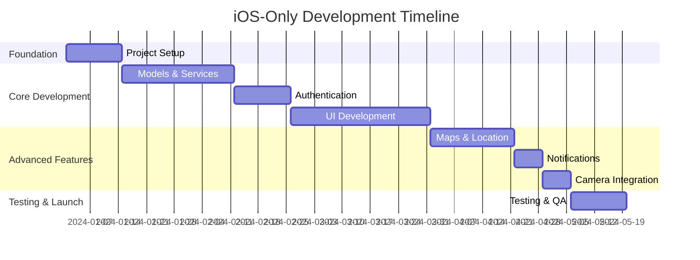
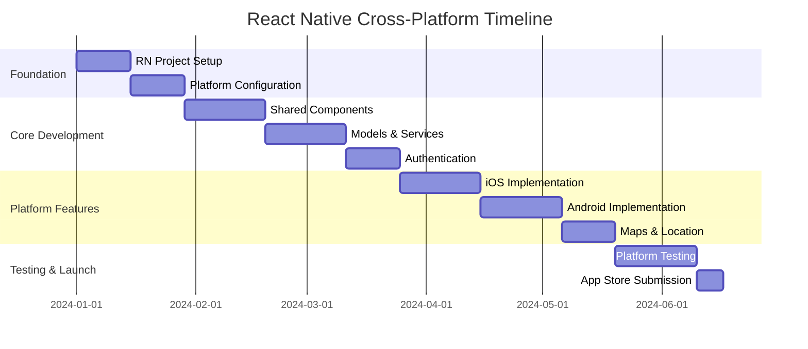
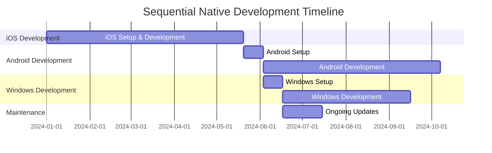

# Non-Apple Device Strategy Plan

## OrbitAg Mobile Access Control - Cross-Platform Development Options

### Overview

This document outlines strategic options for extending the OrbitAg Mobile Access Control application beyond iOS to support Android and PC Windows platforms. Each option presents different trade-offs in terms of development time, cost, user experience, and maintenance complexity.

## Strategic Options Summary

| Option | Platforms | Development Time | Cost | User Experience | Maintenance |
|--------|-----------|------------------|------|----------------|-------------|
| **Option 1** | iOS Only | 20 weeks | Low | Excellent | Simple |
| **Option 2** | iOS + Android + PC (React Native) | 24 weeks | Medium | Good | Medium |
| **Option 3** | iOS → Android → PC (Sequential) | 45 weeks | High | Excellent | Complex |
| **Option 4** | Flutter Cross-Platform | 26 weeks | Medium | Good | Medium |
| **Option 5** | Progressive Web App (PWA) | 16 weeks | Low | Fair | Simple |

---

## Option 1: iOS-Centric Development Only

### 🍎 **Focus: Apple Ecosystem Exclusive**

#### Strategy Overview

Develop exclusively for iOS devices (iPhone/iPad) with the highest quality native experience possible. This approach maximizes the iOS user experience while keeping development focused and manageable.

#### Target Devices

- **Primary:** iPhone (iOS 15+)
- **Secondary:** iPad (iPadOS 15+)
- **Excluded:** Android phones, Windows PCs, web browsers

#### Technical Implementation

```
Technology Stack:
├── Frontend: Swift + UIKit/SwiftUI
├── Backend: Node.js/Express + PostgreSQL
├── Authentication: Auth0 iOS SDK
├── Maps: MapKit (Apple native)
├── Notifications: APNs only
└── Distribution: App Store only
```

#### Advantages ✅

- **Maximum iOS Performance:** Native APIs, optimal battery life, smooth animations
- **Fastest Time to Market:** 20 weeks to App Store
- **Lowest Development Cost:** Single platform, single codebase
- **Best User Experience:** Follows Apple Human Interface Guidelines perfectly
- **Easier Maintenance:** One codebase, one platform to support
- **Advanced iOS Features:** Full access to Face ID, Siri Shortcuts, iOS widgets

#### Disadvantages ❌

- **Limited Market Reach:** Excludes ~70% of global mobile users (Android)
- **No PC Access:** Field workers with Windows laptops cannot access the app
- **Platform Lock-in:** Users must have iOS devices to participate
- **Potential Business Risk:** Missing opportunities in Android-heavy markets

#### Timeline: 20 Weeks



#### Cost Estimate - Option 1

- **Tools & Services:** $2,000/year

#### Recommendation Score: ⭐⭐⭐⭐☆

**Best for:** Organizations with primarily iOS user base, tight budgets, or quick time-to-market needs.

---

## Option 2: React Native Cross-Platform

### 📱 **Focus: Write Once, Run Everywhere**

#### Strategy Overview

Use React Native to build a single codebase that runs on iOS, Android, and potentially Windows. This provides broad platform coverage with moderate development overhead.

#### Target Devices

- **iOS:** iPhone/iPad (iOS 13+)
- **Android:** Smartphones/Tablets (Android 8+)
- **Windows:** PC via React Native Windows (optional)
- **Web:** PWA deployment possible

#### Technical Implementation

```
Technology Stack:
├── Frontend: React Native + TypeScript
├── State Management: Redux Toolkit
├── Backend: Node.js/Express + PostgreSQL
├── Authentication: Auth0 React Native SDK
├── Maps: React Native Maps (Google Maps)
├── Notifications: Firebase Cloud Messaging
├── Navigation: React Navigation
└── UI: React Native Elements + styled-components
```

#### Platform-Specific Considerations

```typescript
// Platform-specific implementations
├── ios/
│   ├── Authentication: Auth0 iOS SDK
│   ├── Maps: Apple MapKit bridge
│   ├── Notifications: APNs
│   └── Biometrics: Touch ID/Face ID
├── android/
│   ├── Authentication: Auth0 Android SDK
│   ├── Maps: Google Maps
│   ├── Notifications: FCM
│   └── Biometrics: Android Biometric API
└── windows/ (optional)
    ├── Authentication: Auth0 Windows
    ├── Maps: Bing Maps
    └── Notifications: Windows Notification Service
```

#### Advantages ✅

- **Broad Market Reach:** Covers iOS, Android, and potentially Windows
- **Code Reuse:** ~80% code sharing between platforms
- **Faster Multi-Platform Development:** One team, one codebase base
- **Cost Effective:** Lower than building separate native apps
- **Familiar Technology:** React developers can contribute
- **Good Performance:** Near-native performance for most use cases

#### Disadvantages ❌

- **Compromise on Native Feel:** May not feel 100% native on each platform
- **Limited Platform Features:** Some iOS/Android specific features harder to implement
- **Dependency Risk:** Reliant on React Native ecosystem stability
- **Debugging Complexity:** Platform-specific issues can be harder to debug
- **Larger App Size:** Generally larger than pure native apps
- **Performance Limitations:** CPU-intensive tasks may be slower

#### Timeline: 24 Weeks



#### Cost Estimate - Option 2

- **Tools & Services:** $4,000/year

#### Platform Coverage Breakdown

| Platform | Market Share | Implementation Effort | User Experience |
|----------|--------------|----------------------|-----------------|
| iOS | 27% global | Medium | Excellent |
| Android | 71% global | Medium | Good |
| Windows | Optional | High | Fair |

#### Recommendation Score: ⭐⭐⭐⭐⭐

**Best for:** Organizations needing broad platform coverage with moderate budget and timeline constraints.

---

## Option 3: Sequential Native Development

### 🔄 **Focus: Platform-by-Platform Excellence**

#### Strategy Overview

Build high-quality native applications for each platform sequentially, starting with iOS, then Android, then Windows. This approach maximizes user experience on each platform at the cost of longer development time.

#### Development Sequence

1. **Phase 1:** iOS Native App (20 weeks)
2. **Phase 2:** Android Native App (20 weeks)
3. **Phase 3:** Windows Desktop App (15 weeks)

#### Technical Implementation

##### iOS (Weeks 1-20)

```
iOS Stack:
├── Language: Swift
├── UI: UIKit/SwiftUI
├── Backend: Auth0 + PostgreSQL API
├── Maps: MapKit
└── Distribution: App Store
```

##### Android (Weeks 21-40)

```
Android Stack:
├── Language: Kotlin
├── UI: Jetpack Compose
├── Backend: Same API as iOS
├── Maps: Google Maps SDK
└── Distribution: Google Play Store
```

##### Windows (Weeks 41-55)

```
Windows Stack:
├── Language: C# + .NET
├── UI: WinUI 3 or Electron
├── Backend: Same API
├── Maps: Bing Maps or web integration
└── Distribution: Microsoft Store + Direct
```

#### Advantages ✅

- **Best User Experience:** Each app follows platform conventions perfectly
- **Maximum Feature Access:** Full access to platform-specific capabilities
- **Independent Development:** Teams can work on different platforms simultaneously
- **Lower Risk:** Platform issues don't affect other platforms
- **Easier Debugging:** Native tools and debugging environments
- **Performance Optimized:** Each app optimized for its specific platform

#### Disadvantages ❌

- **Longest Timeline:** 45+ weeks total development time
- **Highest Cost:** Three separate development efforts
- **Complex Maintenance:** Three codebases to maintain and update
- **Resource Intensive:** Requires expertise in multiple technologies
- **Feature Parity Challenges:** Keeping features synchronized across platforms
- **Delayed ROI:** Long time before full platform coverage

#### Timeline: 45 Weeks



#### Cost Estimate - Option 3

- **Tools & Services:** $8,000/year

#### Platform Development Details

##### iOS Phase (Weeks 1-20)

- Full native iOS development as outlined in previous documents
- Complete feature set with iOS-specific optimizations
- App Store submission and approval

##### Android Phase (Weeks 21-40)

- Kotlin-based development with Jetpack Compose
- Android-specific features (Material Design, Google Services)
- Google Play Store submission

##### Windows Phase (Weeks 41-55)

- Desktop application for Windows 10/11
- Focus on productivity and larger screen optimization
- Microsoft Store and direct distribution

#### Recommendation Score: ⭐⭐⭐☆☆

**Best for:** Large enterprises with substantial budgets, long-term platform strategies, and quality-first requirements.

---

## Option 4: Flutter Cross-Platform

### 🌈 **Focus: Google's Cross-Platform Solution**

#### Strategy Overview

Use Flutter to build a single codebase that compiles to native code for iOS, Android, Windows, and web. Flutter provides excellent performance and UI consistency across platforms.

#### Target Platforms

- **Mobile:** iOS, Android
- **Desktop:** Windows, macOS, Linux
- **Web:** Progressive Web App

#### Technical Implementation

```
Flutter Stack:
├── Language: Dart
├── Framework: Flutter 3.x
├── State Management: Riverpod/Bloc
├── Backend: Same REST API
├── Authentication: Auth0 Flutter SDK
├── Maps: Google Maps Flutter plugin
├── Notifications: Firebase Messaging
└── UI: Material Design + Cupertino widgets
```

#### Advantages ✅

- **Single Codebase:** One codebase for all platforms
- **Native Performance:** Compiles to native code
- **Consistent UI:** Same look across platforms (with platform adaptations)
- **Growing Ecosystem:** Strong Google backing and community
- **Hot Reload:** Fast development iteration
- **Desktop Support:** Native Windows/macOS/Linux apps

#### Disadvantages ❌

- **Learning Curve:** Dart language and Flutter framework
- **App Size:** Larger app sizes due to Flutter engine
- **Platform Integration:** Some platform-specific features require custom plugins
- **Ecosystem Maturity:** Newer than React Native, fewer third-party packages

#### Timeline: 26 Weeks

#### Cost Estimate - Option 4
- **Tools & Services:** $3,500/year

#### Recommendation Score: ⭐⭐⭐⭐☆

**Best for:** Teams willing to adopt new technology for comprehensive platform coverage.

---

## Option 5: Progressive Web App (PWA)

### 🌐 **Focus: Web-First Universal Access**

#### Strategy Overview

Build a modern web application that works on all devices through browsers, with native app-like features through Progressive Web App technologies.

#### Target Access Methods

- **iOS:** Safari browser + "Add to Home Screen"
- **Android:** Chrome browser + PWA installation
- **Windows:** Chrome/Edge browser + desktop PWA
- **Any Device:** Standard web browser access

#### Technical Implementation

```
PWA Stack:
├── Frontend: React/Vue.js + TypeScript
├── PWA: Service Workers + Web App Manifest
├── UI: Responsive CSS + Touch optimization
├── Backend: Same REST API
├── Authentication: Auth0 SPA SDK
├── Maps: Google Maps JavaScript API
├── Notifications: Web Push API
├── Offline: IndexedDB + Cache API
└── Deployment: CDN + HTTPS
```

#### Advantages ✅

- **Universal Access:** Works on any device with a browser
- **Easy Distribution:** No app store approval process
- **Instant Updates:** Users always have the latest version
- **Low Development Cost:** Single web application
- **Easy Maintenance:** One codebase to maintain
- **SEO Benefits:** Discoverable through search engines

#### Disadvantages ❌

- **Limited Native Features:** Restricted access to device capabilities
- **Performance Limitations:** Slower than native apps
- **iOS Limitations:** Apple restricts PWA features on iOS
- **Offline Limitations:** More complex offline synchronization
- **User Perception:** May feel less "professional" than native apps

#### Timeline: 16 Weeks

#### Cost Estimate - Option 5

- **Tools & Services:** $2,000/year

#### Recommendation Score: ⭐⭐⭐☆☆

**Best for:** Budget-conscious projects needing immediate universal access.

---

## Decision Matrix & Recommendations

### Business Requirements Assessment

#### Market Coverage Requirements

| Requirement | Option 1 | Option 2 | Option 3 | Option 4 | Option 5 |
|-------------|----------|----------|----------|----------|----------|
| iOS Coverage | ✅ Excellent | ✅ Good | ✅ Excellent | ✅ Good | ⚠️ Limited |
| Android Coverage | ❌ None | ✅ Good | ✅ Excellent | ✅ Good | ✅ Good |
| Windows Coverage | ❌ None | ⚠️ Limited | ✅ Excellent | ✅ Good | ✅ Good |
| Time to Market | ✅ Fast | ✅ Moderate | ❌ Slow | ⚠️ Moderate | ✅ Fast |

#### Technical Considerations

| Factor | Option 1 | Option 2 | Option 3 | Option 4 | Option 5 |
|--------|----------|----------|----------|----------|----------|
| Performance | ✅ Excellent | ✅ Good | ✅ Excellent | ✅ Good | ⚠️ Fair |
| Maintenance | ✅ Simple | ⚠️ Medium | ❌ Complex | ⚠️ Medium | ✅ Simple |
| Development Cost | ✅ Low | ⚠️ Medium | ❌ High | ⚠️ Medium | ✅ Low |
| Feature Access | ✅ Full | ⚠️ Limited | ✅ Full | ⚠️ Limited | ❌ Very Limited |

### Situational Recommendations

#### Scenario 1: Startup/Small Business

**Recommendation: Option 1 (iOS Only) → Option 2 (React Native)**

- Start with iOS to validate market and generate revenue
- Expand to React Native once product-market fit is established
- Timeline: 20 weeks initial + 12 weeks expansion

#### Scenario 2: Enterprise with Mixed Device Environment

**Recommendation: Option 2 (React Native)**

- Covers all major platforms efficiently
- Good balance of cost, timeline, and coverage
- Timeline: 24 weeks

#### Scenario 3: Large Agricultural Corporation

**Recommendation: Option 3 (Sequential Native)**

- Maximum quality and platform optimization
- Budget allows for premium approach
- Timeline: 45 weeks

#### Scenario 4: Budget-Constrained Organization

**Recommendation: Option 5 (PWA) → Option 1 (iOS)**

- Start with PWA for immediate universal access
- Develop native iOS app for premium users
- Timeline: 16 weeks + 20 weeks

### Implementation Roadmap

#### Recommended Hybrid Approach: "iOS First, Expand Smart"

**Phase 1: iOS Native (Weeks 1-20)**

- Build high-quality iOS app following the established plan
- Validate product-market fit and user requirements
- Generate initial revenue and user feedback

**Phase 2: Market Assessment (Weeks 21-24)**

- Analyze user demographics and platform preferences
- Assess demand for Android/Windows support
- Plan expansion strategy based on data

**Phase 3: Platform Expansion (Weeks 25-48)**

- **If Android demand is high:** React Native migration
- **If enterprise Windows demand:** Desktop application
- **If broad access needed:** PWA development

#### Risk Mitigation Strategies

##### Technical Risks

- **Cross-Platform Compatibility:** Start with shared API design
- **Performance Issues:** Prototype critical features early
- **Platform-Specific Bugs:** Maintain device testing labs

##### Business Risks

- **Market Timing:** Monitor competitor platforms and user requests
- **Resource Allocation:** Plan for platform expertise acquisition
- **User Experience:** Maintain quality standards across platforms

## Conclusion

The optimal strategy depends on your specific business requirements, budget, timeline, and target user base. For most agricultural organizations, we recommend starting with **Option 1 (iOS Only)** to establish market presence quickly, then expanding through **Option 2 (React Native)** based on user demand and market validation.

This approach minimizes initial risk while preserving options for future platform expansion, ensuring sustainable growth and optimal resource utilization.
